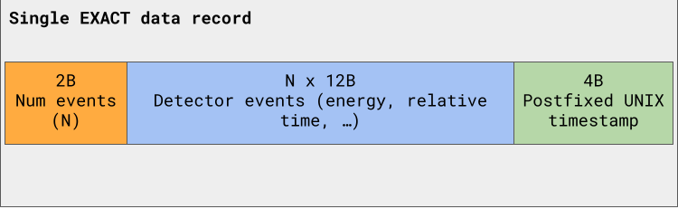
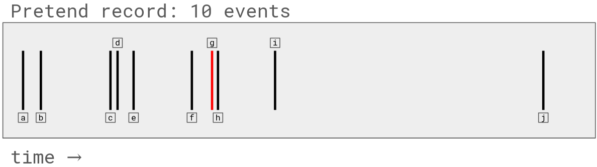

# EXACT timing details
This document describes 
- The EXACT data product
- How the GPS time is meant to be associated with photon events from EXACT.

## Data product
The EXACT detectors count single X-ray photons,
    and each photon generates its own event.
The EXACT data product is packetized into chunks of events with a timestamp.

The data produced by each Bridgeport Instruments
    board comes in blocks of ≤ 2048 events.
Usually each block is 2048 events,
    but sometimes it is fewer.
Each event occupies 12B and contains the energy and time of the incident photon,
    as well as other diagnostic data like if the event
    led to integral overflow,
    or if it caused the detector preamplifier to hit a voltage rail.
The details of the 12B events are defined by Bridgeport
    and detailed in a
    [document on the IMPRESS Google Drive](https://drive.google.com/file/d/13mLWfhBhoJyiL4Ph0IBVupMZWh-V8y1D).
They are also defined in C++ at
    `flight-controller/controller-code/sipm3k-interface/IoContainer.hh`
    in the struct `SipmUsb::NrlListDataPoint`.
Synchronization to GPS time is done via a pulse per second (PPS) signal.
Some events are marked as special PPS events.
We **post**pend a timestamp to each block.
The timestamp corresponds to the **last PPS in the event stream**,
    not the first.
The timestamp is synchronized to GPS time.

#### Code implementation details
The data saving is implemented by a `DataSaver` object.
The `DataSaver` sends a chunk of data via UDP socket.
For EXACT,
    the meat of the logic is implemented in `HafxControl::poll_save_nrl_list`.
The data product that comes out of the detector is defined
    in `SipmUsb::NrlListDataPoint`.
At least one PPS event must be present in every event buffer saved.
_Most_ buffers saved will contain 2048 events,
    but it could be fewer.

### Description of data products
The data products are packed binary data.
In flight,
    they are not saved as text or JSON.
They must be decoded on the ground.
There are decoding utilities in the `python` directory contained in the
    `umn-detector-code` repository.
The `python` directory has installation instructions and
    must be installed like a Python package to be used properly.
After installation,
    you can look at the Jupyter Notebook `python/examples/NRL list mode.ipynb`
    to see how to read in the flight data and decode it.
**The Jupyter Notebook example is not sufficient for performing EXACT science.**
It does not perform any sort of clock drift adjustments.
It is just an example of how to parse the data.

#### Diagram of example data product

### Timing information
The PPS rising edge is used to ensure synchronization,
    so be sure that the rising edge is configured to align with the clock tick
    in any GPS confiruation that needs to happen.
The computer which stamps the time must also be synchronized to GPS time
    using e.g. [chronyd]().
In other terms,
    the computer stamping the time (for EXACT, the Raspberry Pi)
    is a [Stratum 1 NTP](https://docs.redhat.com/en/documentation/red_hat_enterprise_linux/6/html/deployment_guide/s1-ntp_strata) device.

The timestamp is a 32-bit unsigned integer which corresponds to the
    UNIX time in seconds,
    **rounded down to the closest second**.
The UNIX time and the GPS time are completely interoperable
    under an affine transformation.
The definitions of UNIX and GPS time can be used to define the
    transformation.
Folks have already written programs that do this conversion,
    e.g. [here](https://www.andrews.edu/~tzs/timeconv/timealgorithm.html).

## Naive reconstruction algorithm
As described above,
    the PPS is used to synchronize the detector relative timestamps
    (blue box in diagram) with the GPS time.
The last PPS event inserted into the data stream is used
    as a timing anchor.

Pretend there are only ten events in an EXACT buffer,
    one of which is a PPS event (red bar in the diagram).

Each X-ray photon event has an associated relative timetsamp,
    denoted `a, b, c, ...`.
The relative timestamps are assigned by the Bridgeport FPGA.
The timestamps are in units of 25ns (= 1 / 40MHz).

The PPS event has the relative timestamp `g`.
Say `g = 1234` clock cycles,
    `a = 123` clock cycles,
    and `h = 1250` clock cycles.

We know that at the postfixed UNIX time (green box above),
    the PPS ticked.
So,
    we associate the relative timestamp `g = 1234` with the most recent
    UNIX time;
    call that timestamp `T`.
The event at timestamp `g` occurred at `T +- 25ns` or so.
The uncertainty is due to the PPS delay and the FPGA clock cycle time.
The event at timestamp `h` occurred at `(T + 16*25ns) +- ?`.
The event at timestamp `a` occurred at `(T - 1111*25ns)  +- ?`.
The question marks require uncertainty propagation.
The Bridgeport clock has a 50 ppm accuracy.
This is the linear clock drift rate.
We don't have much more information than that.

If there were two PPS events in the stream,
    you could try to measure the clock drift.
During normal operation,
    there should be several PPS events saved per buffer.
The count rates in space (~100ct/sec/detector)
    are sufficiently low that more than one PPS
    should occur per 2048 event buffer.

**In summary,
    the absolute timestamps of EXACT photon events are constructed as follows:**
1. Associate the last PPS event in each record with the postfixed timestamp.
2. Compute the relative offsets from that PPS event. This gives you the zeroth-order approximation of photon arrival time.
3. Propagate uncertainties. This is the hard part.
